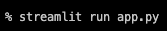
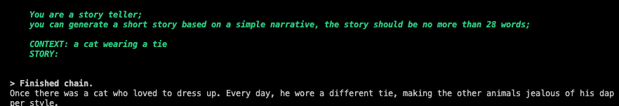
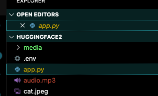
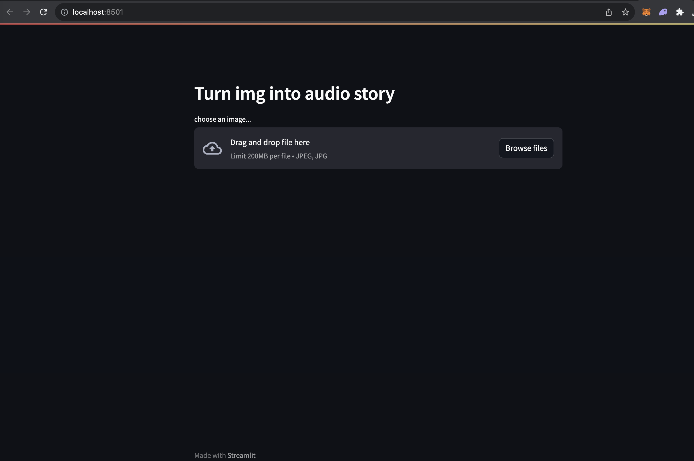
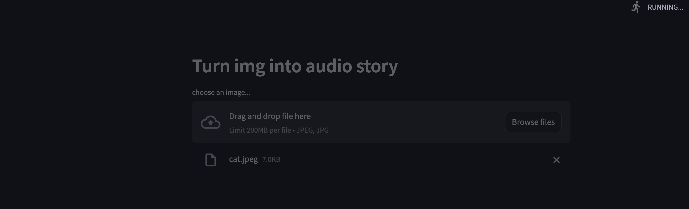
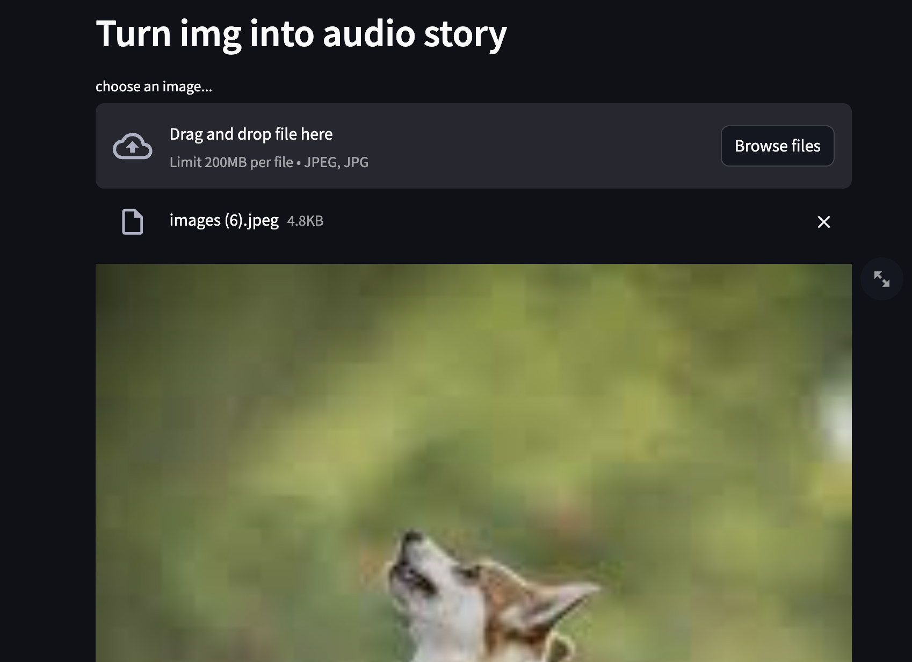
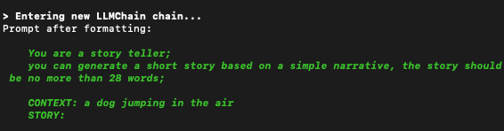
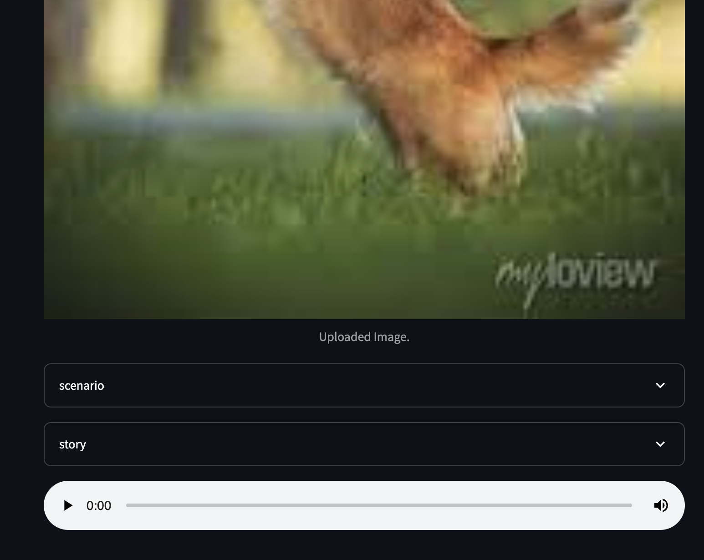

# Hugging Face!
## A demo of Text to speech and other Hugging face models:

 
 

 After cloning the repo, CD to the project directory and run: 

 

 
 
This will launch a local page in your default web browser. 
 
 
 
 

You will also see the LLM generate the sample story based on the sample photograph in the project folder:
 

 
 
It will also generate an audio file in the project folder of sample story:
 
 

 
The page will load a dropable window...
 

 
 Drag and drop any photo into the window. (keep in mind some file formats are not accepted)
 

 
 
Your photo will appear on the page...
 
 

 
 
And a new story will be generated by the img 2 text model.
 
 

 
 
Scroll below the image and click the play button to hear the audio!
 
 

 

<!--

  

